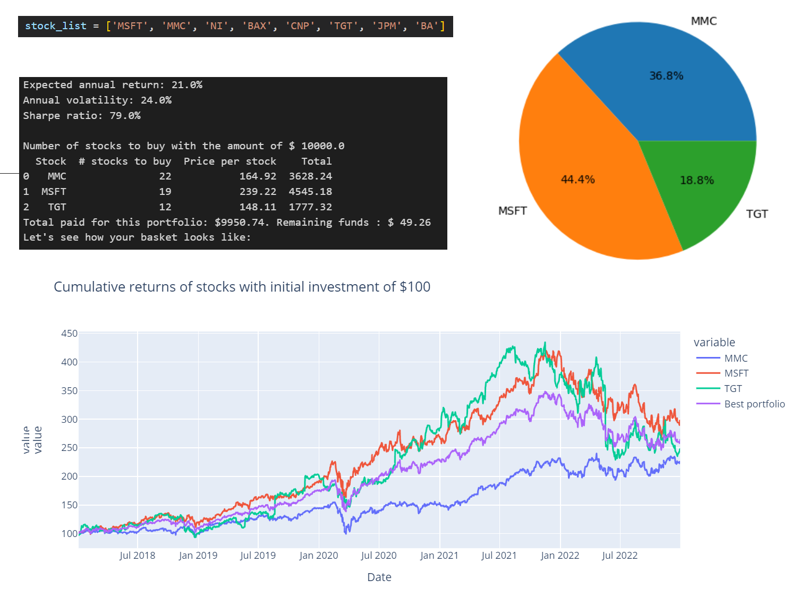
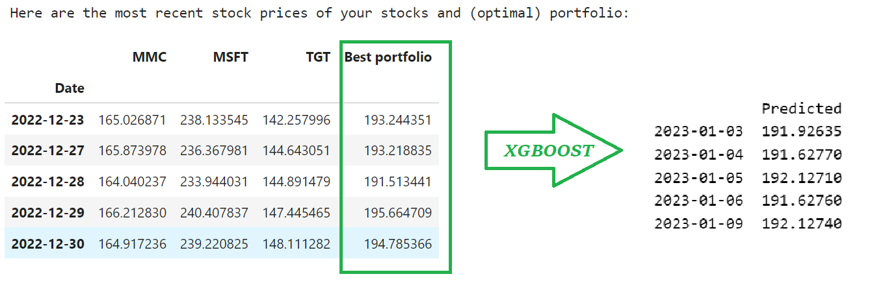

# Portfolio optimization and prediction

This project consists of two parts. The notebook [Optimalisation.ipynb](./Optimalisation.ipynb) optimizes a portfolio and forecasts the future prices of this portfolio. The main [Optimalisation.ipynb](./Optimalisation.ipynb) is the end product of the project but the methods in the predictions folder ([prediction.ipynb](./predictions/prediction.ipynb) and [pycaret.ipynb](./predictions/pycaret.ipynb)) helped to choose the best method for the finalisation of the project. 

## Part 1 - Portfolio optimization and prediction

### Introduction

PyPortfolioOpt is a library that implements portfolio optimization methods. We encourage the use of this portfolio as it's extensive and very easily extensible. In order to find the optimal portfolio, we have used the following classical techniques. 

- Maximum Sharpe Ratio:
This method is used to construct a portfolio that maximizes the Sharpe ratio, which is a measure of the risk-adjusted return of the portfolio.

- Efficient Risk:
This method is used to construct a portfolio that maximizes the expected return for a given level of risk, or alternatively, minimizes the risk for a given level of expected return. 

The explanation of the different methods and more information about portfolio optimization can be found in the documentation of [PyPortfolioOpt](https://pyportfolioopt.readthedocs.io/en/latest/MeanVariance.html).

### Usage 

The notebook start with important functions that can be called in order to find the optimal portfolio and predict its future prices. Here is an example of how to use those functions: 
- Enter the list of stocks you want to analyze.
- Use the `get_data` function and enter the start and end dates for which you want to get the historical stock data.
- Use the `optimize_portfolio` function to optimize the portfolio based on the desired method ('sharpe' or 'risk').
- Use the `info` function to see the expected annual return, annual volatility, and Sharpe ratio of the portfolio.
- Use the `number_of_stocks_to_buy` function to get the number of stocks to buy with the given investment amount.
- Use the `pie_plot` function to create a pie chart showing the distribution of the portfolio weights.

Illustration: 8 stocks and investment of $ 10,000: 

After the optimization part you will get the optimalized dataframe with selected stocks and weighted close prices of the portfolio. This will than be used the predict the future portfolio prices. 

It suffices to use the 'Best portfolio' column in the following functions to make a future prediction: 
- `prepare_data()`
- `predict_head()`

##  Part 2 - Prediction of stock prices with xgboost and pycaret

### Introduction

The notebooks [prediction.ipynb](./predictions/prediction.ipynb) and [pycaret.ipynb](./predictions/pycaret.ipynb) (in folder 'predictions') are mainly used to explore different methods in order to forecast future stock prices. In the first notebook, we utilized the 'xgboost' library, while in the second notebook, we opted for the 'pycaret' library, which is particularly well-suited for individuals with limited experience in machine learning.

The main idea was to select the best (forecasting) method in order to use it in the main project [Optimalisation.ipynb](./Optimalisation.ipynb) above. We'll first explain the methodology of xgboost, followed by pycaret.  

#### Data Retrieval and Preparation

In the first section of the notebook , we retrieve the adjusted closing prices for a list of stocks using Yahoo Finance API. We use the get_data() function to retrieve the data for a specified date range. We then use the prepare_data() function to prepare the data for modeling. In this function, we add lag to the data and split it into training and test sets.

#### Modeling 

We use `xgboost` to build a regression model to predict the stock price of Microsoft. First, we train an `xgboost` model with default parameters using `XGBRegressor()`. We then use a grid search to find the best hyperparameters for our model using `GridSearchCV()`. We search over the hyperparameters `n_estimators`, `max_depth`, and `learning_rate`.

After finding the best parameters using the grid search, we build our final `xgboost` model with the hyperparameters. 

We evaluate our model by computing the root mean squared error (RMSE) on the test set using `mean_squared_error()`. We compare the predicted values to the actual values by plotting them using matplotlib.

#### Prediction 

Finally, we predict the stock prices for the future 5 business days as from January 1st, 2023. We use the `predict_head()` function to make the prediction. Note that the `predict_head()` function will only predict the future 5 business days as from January 1st, 2023, and the function is hardcoded to use the best model we found earlier in the notebook. If you wish to make a prediction for a different date range, you will need to modify the function accordingly.

#### Pycaret

As part of finding the optimal prediction method, we have also explored the librabry pycaret. Keep in mind that this library only works in a Python environment with a Python version of 3.9. There was no `xgboost` in my version of Pycaret and the results of the other models where not better than the `xgboost` model that we have tried earlier. 

## Conclusion

In conclusion, this portfolio optimization and prediction project was a valuable learning experience for us. It provided a deep understanding of financial terminology and the use of libraries like PyPortfolio and Pycaret for optimization and prediction. While the process of choosing the best portfolio was intriguing, we found that predicting stock prices was not as effective. Despite the numerous methods employed, the R-square values indicated that an average of the stock prices would be a better predictor than the machine learning models utilized. Nonetheless, the exploration of various paths in time series forecasting was a necessary step in understanding the complexity of this field. Overall, this project serves as a foundation for further exploration and development in the exciting world of financial prediction and optimization.

## Limitations

- Historical returns have certain limitations when it comes to portfolio optimization, and other approaches are available that can be incorporated into the model.

- No error handling is implemented when downloading large datasets, which could lead to potential errors. Further improvement is needed, and it's also advisable to save the downloaded data.

- There seems to be an issue with displaying some graphs in the notebooks. It is recommended to run all the notebooks to view the graphs, particularly in the Pycaret notebook.

- The optimization and prediction examples and functions require individual adjustments to be utilized and tested. This is not ideal and should be avoided in future works.

- The same functions are utilized in multiple notebooks, which could be resolved by creating a separate .py file for the functions and importing them easily from there.

- The focus of the prediction is mainly on machine learning models and not statistical approaches. It would be beneficial to explore both paths.

